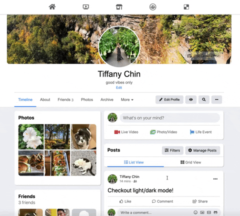
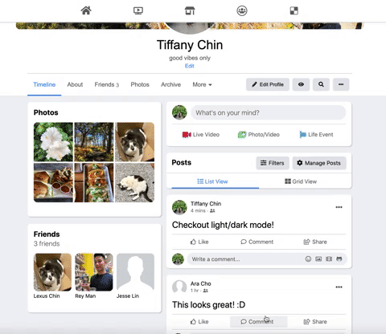
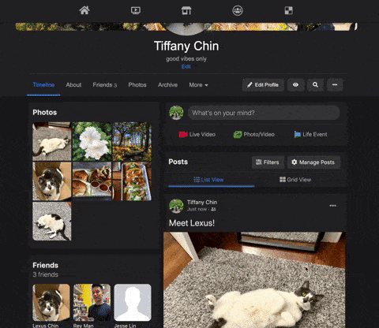
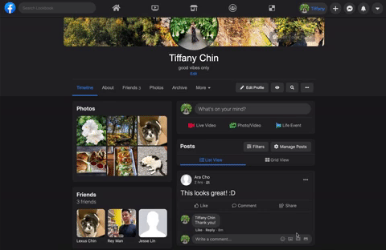
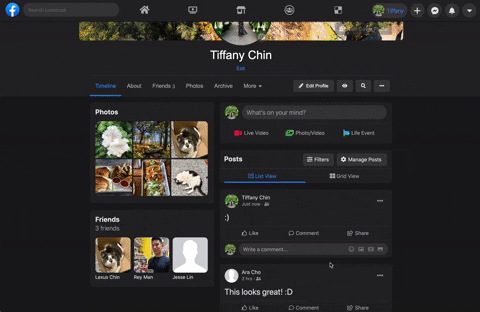
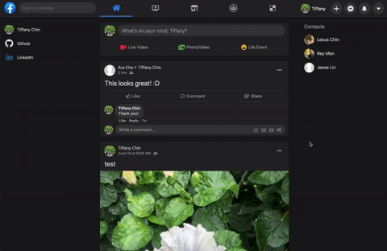

# Lookbook

Lookbook, a [Facebook](https://www.facebook.com/) clone, is a social media application that allows users to create their own personalized profile with which they can interact with other users, upload photos, and more.

Click [here](https://lookbook-aa.herokuapp.com/) to launch Lookbook!

[](https://lookbook-aa.herokuapp.com/)


## Technologies
Lookbook utilizes AWS S3, Heroku, PostGreSQL React, Redux, and Ruby on Rails.

## Features
### User Authentication
- Users must login or signup in order to use Lookbook's features.


### Profiles 
- Users can upload a profile photo, cover photo, and edit their profiles.



- Users can create posts (with or without photos) and comment.



- Once posted, photos are made visible on the sticky sidebar.




### Friending 
- Users can search for friends and post/comment on each others' walls.




### Newsfeed
- Only the user's and friends' posts are displayed on the newsfeed. 



- Users can toggle Lookbook's light/dark mode.



## Code Snippets
When toggling between light and dark mode, the user's selection is saved to and retrieved from local storage in order for each component to render the correct styling.
```javascript
toggleLightDarkMode(e) {
    e.preventDefault();

    if (this.state.darkMode) {
      $('.dark').toggleClass("dark light");
      this.setState({ darkMode: false });
      localStorage.setItem('mode', 'light');
    } else {
      $('.light').toggleClass("dark light");
      this.setState({ darkMode: true });
      localStorage.setItem('mode', 'dark');
    }
  }
```
```javascript 
if (localStorage.getItem('mode') === 'dark') {
  $('.light').toggleClass("dark light");
} else if (localStorage.getItem('mode') === 'light') {
  $('.dark').toggleClass("dark light");
}
```
Posts are timestamped, but the formatting changes depending on the amount of time passed. 
```javascript
postedTimeAgo(datetime) {
  if (this.props.post.created_at === undefined) {
    return "Just now";
  }

  const months = [
    "January",
    "February",
    "March",
    "April",
    "May", 
    "June",
    "July", 
    "August",
    "September",
    "October",
    "November",
    "December"
  ]

  const now = new Date();
  let t = new Date(datetime);
  const then = (t - 10800);
  const secs = ((now.getTime() - then) / 1000);

  if (secs < 120) {
    return "Just now";
  } else if (secs < 3600) {
    return parseInt(secs / 60) + " mins";
  } else if (secs <= 86400 && now.getDate() === t.getDate()) {
    if (secs >= 3600 && secs < 7200 ) {
      return "1 hr";
    } else {
      return parseInt(secs / 3600) + " hrs"
    }
  } 

  let amOrPm = "AM"; 
  if (t.getHours() > 12) {
    amOrPm = "PM";
  }
  
  const hour = t.getHours() % 12 === 0 ? 12 : t.getHours() % 12;
  const min = t.getMinutes() < 10 ? `0${t.getMinutes()}` : t.getMinutes();
  if (secs <= 86400) {
    return `Yesterday at ${hour}:${min} ${amOrPm}`
  }

  let month = months[t.getMonth()];
  let day = t.getDate();
  return `${month} ${day} at ${hour}:${min} ${amOrPm}`;
}
```

## Future Direction
### Notifications
- Users receive notifications for received friend requests.
### Likes, Comments on a Comment
- Users can like a post, comment, or photo.
- Users can comment on a comment. 
### Photo Albums
- Users can see all uploaded photos.
- Users can organize photos into different named albums.
### Messaging 
- Users can message friends with live chat.
