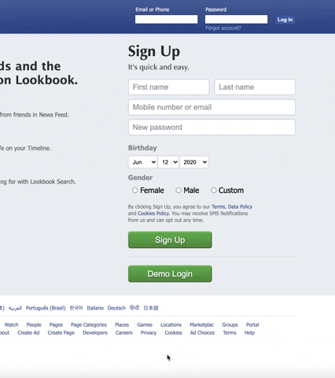

# Lookbook

Lookbook, a [Facebook](https://www.facebook.com/) clone, is a social media application that allows users to create their own personalized profile with which they can interact with other users, upload photos, and more.

Click [here](https://lookbook-aa.herokuapp.com/) to launch Lookbook!

## Technologies
Lookbook utilizes AWS S3, Heroku, PostGresQL React, Redux, and Ruby on Rails.

## Features
### User Authentication

### Profiles 

### Friending 

### Comments/Posting

### Newsfeed

